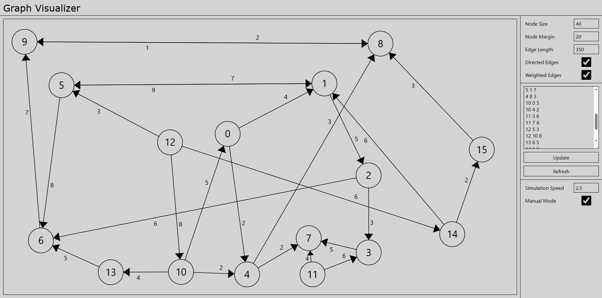

# Graph Visualizer

An interactive tool for the visualization of mathematical graphs.

Hosted at: https://elgv.netlify.app

## Features

*   **Force-Directed Layout**: Nodes respond to spring and repulsion forces, creating organic layouts automatically.
*   **Entanglement Resolution**: Collision forces push intersecting edges apart for better connection visibility.
*   **Graph Theory Support**: Full support for directed graphs with arrows and weighted edges with numeric labels.
*   **Real-time Interaction**: Drag individual nodes to rearrange the layout or pan the entire view to navigate large graphs.
*   **Dynamic Customization**: Adjust visualization parameters on the fly, including node sizing, margins, and edge lengths.
*   **SVG Rendering**: High-quality, scalable graphics that remain sharp at any zoom level.

## Configuration

*   **Node Size**: Adjust the radius of the graph nodes and scale other elements accordingly.
*   **Node Margin**: Set the minimum spacing between nodes to prevent overlapping.
*   **Edge Length**: Control the target distance for the spring-based connections between nodes.
*   **Directed Edges**: Toggle arrowheads to indicate the direction of the edges.
*   **Weighted Edges**: Enable numeric displays above edges to represent weights or costs.
*   **Simulation Speed**: Scale the speed of the layout engine to control how quickly the graph settles.
*   **Manual Mode**: Disable the physics engine to allow for manual node positioning.

## Usage

To generate a graph, enter node pairs into the edge list editor. Weights are optional and will only be displayed if the "Weighted Edges" option is enabled.

- For unweighted graphs, enter node pairs separated by a space:
```
1 2
2 3
3 1
```

- For weighted graphs, enter node pairs followed by a weight:
```
1 2 5
2 3 10
3 1 2.4
```

Use the "Update" button to apply changes to the current graph or "Refresh" to restart the simulation.

## Screenshots


